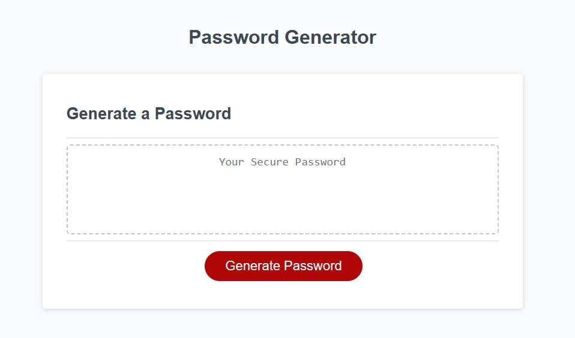
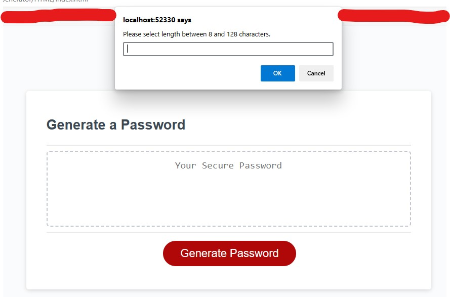
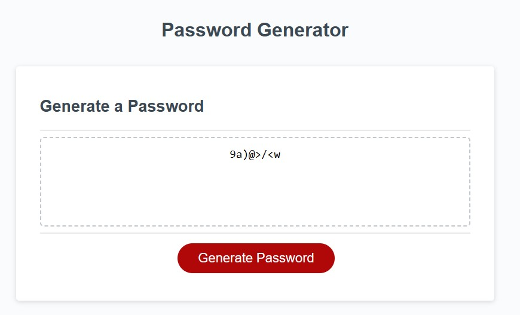

# Password-Generator

## Description

This website was created as a tool to generate a password using various options including length from 8 to 128 characters, capital letters, lowercase letters, symbols, and numbers. This will assist users in enhancing security by having randomized passwords to log in to whatever websites or applications that the user has.

Screenshots as follows:

[Password Generator Webpage]()

[GitHub Repository Link]()

## Usage

When the user clicks the "Generate Password" button, they are prompted to type in the number of characters. This prompt is then followed by 4 other prompts asking to confirm if the user would like capital letters, lowercase letters, symbols, or numbers within their password. Following the final prompt, a password is generated in the textbox.

If the user does not select at least 8 characters or selects more than 128 characters, the user will be advised of the requirement again and then be given another chance to enter in a number. If the user "cancels" out of the following 4 prompts, then a message of "undefined" appears in the textbox.

## Credits

N/A

## License

Please refer to the LICENSE in the repo.